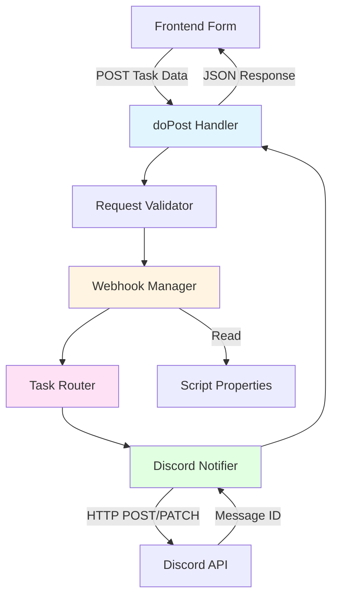
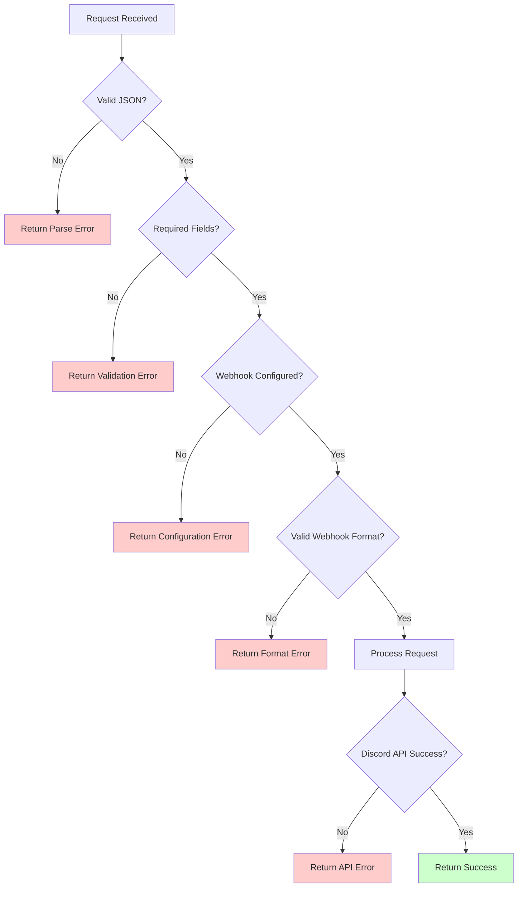

# Design Document: Team-Based Discord Routing

## Overview

This design implements a multi-channel Discord routing system for the task management application. The system routes task notifications to different Discord channels based on team assignment, handles task updates intelligently (same-channel updates vs. cross-channel updates), and broadcasts organization-wide tasks to all channels.

The implementation extends the existing Google Apps Script backend (Code.gs) with minimal changes to maintain backward compatibility. The core enhancement involves replacing the single webhook URL with a team-to-webhook mapping system and adding routing logic to determine target channels based on the `assignedTo` field.

### Key Design Decisions

1. **Script Properties Storage**: Use Google Apps Script's Script Properties for webhook configuration rather than hardcoding or using external storage. This provides secure, persistent storage without additional infrastructure.

2. **Backward Compatibility**: Maintain support for the legacy `DISCORD_WEBHOOK_URL` property as a fallback for the "Everyone" team, ensuring existing deployments continue working.

3. **Cross-Channel Update Strategy**: Create new messages in the new channel rather than attempting to move or delete messages across channels. This preserves conversation history and avoids complex Discord API operations.

4. **Broadcast Implementation**: For "Everyone" tasks, post to all configured channels and return an array of message IDs. Updates to "Everyone" tasks require all message IDs to be provided.

5. **Error Handling Philosophy**: Fail fast with clear error messages for configuration issues, but continue with partial success for broadcast operations (e.g., if one channel fails, update the others).

## Architecture

The system follows a layered architecture with clear separation of concerns:



### Component Responsibilities

- **doPost Handler**: Entry point for all requests, orchestrates the flow, handles errors
- **Request Validator**: Validates incoming task data structure
- **Webhook Manager**: Retrieves and validates webhook URLs from Script Properties
- **Task Router**: Determines target channel(s) based on team assignment and operation type
- **Discord Notifier**: Handles HTTP communication with Discord API (POST/PATCH)

## Components and Interfaces

### 1. Webhook Manager

**Purpose**: Manages webhook URL storage and retrieval with validation.

**Interface**:
```javascript
/**
 * Retrieves webhook URL for a specific team
 * @param {string} team - Team name (e.g., "Marketing Team")
 * @returns {string|null} Webhook URL or null if not configured
 */
function getWebhookUrl(team)

/**
 * Retrieves all configured webhook URLs
 * @returns {Object} Map of team names to webhook URLs
 */
function getAllWebhookUrls()

/**
 * Validates that required webhooks are configured
 * @param {string} team - Team name to validate
 * @returns {Object} {valid: boolean, error: string|null}
 */
function validateWebhookConfig(team)
```

**Implementation Details**:
- Property naming convention: `DISCORD_WEBHOOK_<TEAM>` where `<TEAM>` is uppercase with underscores (e.g., `DISCORD_WEBHOOK_MARKETING_TEAM`)
- Fallback: If team-specific webhook not found, check legacy `DISCORD_WEBHOOK_URL` for "Everyone" team
- Validation: Check URL format matches Discord webhook pattern: `https://discord.com/api/webhooks/{id}/{token}`

### 2. Task Router

**Purpose**: Determines which channel(s) should receive the task notification.

**Interface**:
```javascript
/**
 * Determines routing strategy for a task
 * @param {Object} taskData - Task data including assignedTo and messageId
 * @returns {Object} Routing decision object
 */
function determineRouting(taskData)
```

**Routing Decision Object**:
```javascript
{
  strategy: "single" | "broadcast" | "cross-channel",
  targetTeams: ["Marketing Team"],  // Array of team names
  isUpdate: boolean,
  originalTeam: string|null,  // For cross-channel updates
  requiresNewMessage: boolean
}
```

**Routing Logic**:

1. **New Task (no messageId)**:
   - If `assignedTo === "Everyone"`: strategy = "broadcast", targetTeams = all teams
   - Otherwise: strategy = "single", targetTeams = [assignedTo]

2. **Task Update (has messageId)**:
   - If `assignedTo === "Everyone"`: strategy = "broadcast", isUpdate = true
   - If messageId is array: Must be "Everyone" update, update all channels
   - If messageId is string and assignedTo matches original: strategy = "single", isUpdate = true
   - If messageId is string and assignedTo differs: strategy = "cross-channel", requiresNewMessage = true

**Note**: The router cannot determine if a team has changed without additional context. The frontend must provide either:
- An array of messageIds for "Everyone" tasks
- A single messageId for team-specific tasks

If a single messageId is provided but the task is now "Everyone", treat as cross-channel (create new broadcasts).

### 3. Discord Notifier

**Purpose**: Handles HTTP communication with Discord API.

**Interface**:
```javascript
/**
 * Sends a new message to Discord
 * @param {string} webhookUrl - Discord webhook URL
 * @param {Object} embed - Discord embed object
 * @returns {Object} {messageId: string}
 */
function sendToDiscord(webhookUrl, embed)

/**
 * Updates an existing Discord message
 * @param {string} webhookUrl - Discord webhook URL
 * @param {string} messageId - Message ID to update
 * @param {Object} embed - Discord embed object
 * @returns {Object} {messageId: string}
 */
function updateDiscordMessage(webhookUrl, messageId, embed)

/**
 * Broadcasts message to multiple channels
 * @param {Array<string>} webhookUrls - Array of webhook URLs
 * @param {Object} embed - Discord embed object
 * @returns {Object} {messageIds: Array<string>, errors: Array<Object>}
 */
function broadcastToDiscord(webhookUrls, embed)

/**
 * Updates messages in multiple channels
 * @param {Array<Object>} updates - Array of {webhookUrl, messageId} objects
 * @param {Object} embed - Discord embed object
 * @returns {Object} {messageIds: Array<string>, errors: Array<Object>}
 */
function updateBroadcastMessages(updates, embed)
```

**Implementation Details**:
- Use `UrlFetchApp.fetch()` for HTTP requests
- Add `?wait=true` parameter to POST requests to receive message ID
- PATCH URL format: `https://discord.com/api/webhooks/{id}/{token}/messages/{messageId}`
- Handle HTTP status codes: 200 (success), 404 (message not found), 4xx/5xx (errors)
- For broadcast operations, collect all results before returning (don't fail fast)

### 4. Embed Builder

**Purpose**: Creates Discord embed objects from task data.

**Interface**:
```javascript
/**
 * Creates Discord embed from task data
 * @param {Object} taskData - Task data
 * @param {Object} options - Additional options (isCrossChannel, etc.)
 * @returns {Object} Discord embed payload
 */
function createDiscordEmbed(taskData, options)
```

**Embed Structure**:
```javascript
{
  embeds: [{
    title: string,  // "📋 New Task: " or "📝 Updated Task: " + taskName
    description: string,
    color: number,  // Based on priority
    fields: [
      {name: "Priority", value: string, inline: true},
      {name: "Assigned To", value: string, inline: true},
      {name: "Created By", value: string, inline: true}
    ],
    timestamp: string,  // ISO 8601
    footer: {text: "Task Management System"}
  }]
}
```

**Cross-Channel Indicator**:
When `options.isCrossChannel === true`, add a field:
```javascript
{
  name: "⚠️ Reassigned",
  value: `This task was reassigned from ${options.originalTeam}`,
  inline: false
}
```

## Data Models

### Task Data (Input)

```javascript
{
  taskName: string,        // Required
  description: string,     // Optional
  priority: "High" | "Medium" | "Low",  // Required
  assignedTo: string,      // Required: team name or "Everyone"
  user: string,            // Required: creator name
  messageId: string | Array<string> | undefined  // Optional: for updates
}
```

### Script Properties Schema

```
DISCORD_WEBHOOK_MARKETING_TEAM = "https://discord.com/api/webhooks/..."
DISCORD_WEBHOOK_CREATIVES_TEAM = "https://discord.com/api/webhooks/..."
DISCORD_WEBHOOK_DEVELOPMENT_TEAM = "https://discord.com/api/webhooks/..."
DISCORD_WEBHOOK_OPERATIONS_TEAM = "https://discord.com/api/webhooks/..."
DISCORD_WEBHOOK_EVERYONE = "https://discord.com/api/webhooks/..."
DISCORD_WEBHOOK_URL = "https://discord.com/api/webhooks/..."  // Legacy fallback
```

### API Response (Output)

**Success Response**:
```javascript
{
  success: true,
  messageId: string | Array<string>,  // String for single, Array for broadcast
  timestamp: string  // ISO 8601
}
```

**Error Response**:
```javascript
{
  success: false,
  error: string,      // Error type: "Configuration error", "Message not found", etc.
  details: string     // Detailed error message
}
```

### Routing Decision Object

```javascript
{
  strategy: "single" | "broadcast" | "cross-channel",
  targetTeams: Array<string>,
  isUpdate: boolean,
  originalTeam: string | null,
  requiresNewMessage: boolean
}
```

## Correctness Properties

*A property is a characteristic or behavior that should hold true across all valid executions of a system—essentially, a formal statement about what the system should do. Properties serve as the bridge between human-readable specifications and machine-verifiable correctness guarantees.*


### Property Reflection

After analyzing all acceptance criteria, I identified several opportunities to consolidate redundant properties:

**Consolidations Made**:
1. Requirements 2.1-2.5 (routing to specific teams) can be combined into a single property: "For any team assignment, tasks route to the correct channel"
2. Requirements 3.2 and 4.2 both deal with message ID behavior but in different contexts - kept separate as they test different invariants
3. Requirements 6.1 and 1.3 both test missing webhook validation - consolidated into one property
4. Requirements 7.1, 7.2, and 7.3 all test response structure - kept separate as they test different response types
5. Requirements 8.1 and 8.4 both test URL construction - consolidated into one property about correct URL formatting

**Properties Marked as Non-Testable**:
- All logging requirements (9.1-9.4): Logging is not a functional behavior testable through the API
- Storage mechanism (1.1): Tested indirectly through retrieval
- General compatibility statement (7.4): Covered by specific response structure properties

### Property 1: Webhook Configuration Round-Trip

*For any* team with a configured webhook URL, storing the URL in Script Properties and then retrieving it should return the same URL value.

**Validates: Requirements 1.2**

### Property 2: Missing Webhook Error Handling

*For any* team without a configured webhook URL, attempting to route a task to that team should return an error response indicating the missing configuration for that specific team.

**Validates: Requirements 1.3, 6.1, 6.2**

### Property 3: Team-Based Routing Correctness

*For any* new task with a specific team assignment (Marketing, Creatives, Development, Operations, or Everyone), the task should be routed to the webhook URL(s) corresponding to that team.

**Validates: Requirements 2.1, 2.2, 2.3, 2.4, 2.5**

### Property 4: Message ID Return on Send

*For any* task successfully sent to Discord, the backend response should contain a message ID (either a single string or an array of strings for broadcasts).

**Validates: Requirements 2.6**

### Property 5: Same-Channel Update Preserves Message ID

*For any* task update where the assignedTo team has not changed, the returned message ID should be identical to the provided message ID, confirming the same message was updated.

**Validates: Requirements 3.1, 3.2**

### Property 6: Message Not Found Error

*For any* task update with an invalid or non-existent message ID, the backend should return an error response with error type "Message not found".

**Validates: Requirements 3.3**

### Property 7: Cross-Channel Update Creates New Message

*For any* task update where the assignedTo team has changed from the original, the backend should return a new message ID different from the provided message ID, confirming a new message was created.

**Validates: Requirements 4.1, 4.2**

### Property 8: Cross-Channel Reassignment Indicator

*For any* cross-channel task update, the Discord embed should contain a field indicating the task was reassigned, including the original team name.

**Validates: Requirements 4.3**

### Property 9: Original Message Preservation

*For any* cross-channel task update, the original message in the old channel should remain unmodified and not be deleted.

**Validates: Requirements 4.4**

### Property 10: Broadcast to All Channels

*For any* new task assigned to "Everyone", the task should be posted to all configured team channels, and the response should contain an array of message IDs with length equal to the number of configured channels.

**Validates: Requirements 5.1, 5.2**

### Property 11: Broadcast Update Preserves All Messages

*For any* task update assigned to "Everyone" with an array of message IDs, all provided message IDs should be preserved in the response, confirming all messages were updated.

**Validates: Requirements 5.3**

### Property 12: Partial Broadcast Failure Handling

*For any* broadcast operation where at least one channel fails, the backend should continue processing remaining channels and return both successful message IDs and error details for failed channels.

**Validates: Requirements 5.4**

### Property 13: Everyone Configuration Validation

*For any* task assigned to "Everyone", if any team webhook URL is missing from the configuration, the backend should return an error indicating which team configurations are missing.

**Validates: Requirements 6.3**

### Property 14: Configuration Error Response Format

*For any* configuration error (missing webhook, invalid format, etc.), the backend should return HTTP 200 with a JSON response containing success: false, error field, and details field.

**Validates: Requirements 6.4**

### Property 15: Success Response Structure

*For any* successful task submission, the backend response should be a JSON object containing exactly three fields: success (true), messageId (string or array), and timestamp (ISO 8601 string).

**Validates: Requirements 7.1**

### Property 16: Error Response Structure

*For any* error during task processing, the backend response should be a JSON object containing exactly three fields: success (false), error (string), and details (string).

**Validates: Requirements 7.2**

### Property 17: Broadcast Response Format

*For any* task assigned to "Everyone", the messageId field in the success response should be an array of strings, not a single string.

**Validates: Requirements 7.3**

### Property 18: Webhook URL Parsing Correctness

*For any* valid Discord webhook URL, the system should correctly extract the webhook ID and token, and construct PATCH URLs in the format `https://discord.com/api/webhooks/{id}/{token}/messages/{messageId}`.

**Validates: Requirements 8.1, 8.4**

### Property 19: Invalid Webhook URL Error

*For any* webhook URL that does not match the Discord format pattern `webhooks/{id}/{token}`, the system should return an error indicating invalid webhook URL format.

**Validates: Requirements 8.2**

### Property 20: Wait Parameter on POST Requests

*For any* new message sent to Discord (POST operation), the request URL should include the `wait=true` query parameter to ensure the message ID is returned in the response.

**Validates: Requirements 8.3**

## Error Handling

The system implements a comprehensive error handling strategy with clear error types and detailed messages:

### Error Categories

1. **Configuration Errors**
   - Missing webhook URL for team
   - Invalid webhook URL format
   - Incomplete "Everyone" configuration (missing any team webhook)
   - Response: `{success: false, error: "Configuration error", details: "..."}`

2. **Validation Errors**
   - Missing required fields (taskName, user, assignedTo)
   - Invalid team name
   - Response: `{success: false, error: "Invalid request", details: "..."}`

3. **Discord API Errors**
   - Message not found (404)
   - Rate limiting (429)
   - Server errors (5xx)
   - Response: `{success: false, error: "Discord API error", details: "..."}`

4. **Partial Broadcast Failures**
   - Some channels succeed, others fail
   - Response: `{success: true, messageIds: [...], errors: [{team: "...", error: "..."}]}`

### Error Handling Flow



### Logging Strategy

All errors and routing decisions are logged using `Logger.log()` for troubleshooting:

- **Configuration checks**: Log team name and webhook status
- **Routing decisions**: Log strategy (single/broadcast/cross-channel) and target teams
- **Cross-channel updates**: Log original and new team assignments
- **Broadcast operations**: Log success/failure for each channel
- **API errors**: Log full error response from Discord

Log format: `[COMPONENT] Action: Details`

Examples:
- `[WebhookManager] Retrieved webhook for Marketing Team: configured`
- `[TaskRouter] Routing strategy: broadcast, targets: 4 teams`
- `[DiscordNotifier] Cross-channel update detected: Development Team -> Marketing Team`
- `[DiscordNotifier] Broadcast result: 3 succeeded, 1 failed (Operations Team)`

## Testing Strategy

This feature requires a dual testing approach combining unit tests for specific scenarios and property-based tests for comprehensive coverage.

### Unit Testing

Unit tests focus on specific examples, edge cases, and integration points:

**Configuration Management**:
- Test retrieval of each team's webhook URL
- Test fallback to legacy `DISCORD_WEBHOOK_URL` for "Everyone"
- Test error when webhook is missing
- Test error when webhook format is invalid

**Routing Logic**:
- Test routing for each specific team (Marketing, Creatives, Development, Operations)
- Test "Everyone" routing to all channels
- Test cross-channel update detection
- Test same-channel update detection

**Discord API Integration**:
- Test POST request with wait=true parameter
- Test PATCH request URL construction
- Test 404 error handling (message not found)
- Test successful response parsing

**Edge Cases**:
- Empty task name or user
- Task with no description
- Update with invalid message ID
- Broadcast with one channel failing
- Cross-channel update with missing new channel webhook

### Property-Based Testing

Property-based tests verify universal properties across randomized inputs using **fast-check** (JavaScript property testing library).

**Configuration**: Each property test runs minimum 100 iterations.

**Test Tagging**: Each test includes a comment referencing the design property:
```javascript
// Feature: team-based-discord-routing, Property 3: Team-Based Routing Correctness
```

**Property Test Cases**:

1. **Webhook Round-Trip** (Property 1)
   - Generate: Random team names and webhook URLs
   - Test: Store then retrieve equals original
   - Validates: Configuration persistence

2. **Missing Webhook Errors** (Property 2)
   - Generate: Random team names without webhooks
   - Test: All return configuration errors
   - Validates: Error handling consistency

3. **Team Routing** (Property 3)
   - Generate: Random tasks with various team assignments
   - Test: Each routes to correct webhook
   - Validates: Routing correctness

4. **Message ID Return** (Property 4)
   - Generate: Random valid tasks
   - Test: All successful sends return message IDs
   - Validates: Response completeness

5. **Same-Channel Updates** (Property 5)
   - Generate: Random task updates with unchanged team
   - Test: Message ID preserved in response
   - Validates: Update behavior

6. **Message Not Found** (Property 6)
   - Generate: Random invalid message IDs
   - Test: All return "Message not found" error
   - Validates: Error handling

7. **Cross-Channel New Message** (Property 7)
   - Generate: Random task updates with changed team
   - Test: New message ID returned
   - Validates: Cross-channel behavior

8. **Reassignment Indicator** (Property 8)
   - Generate: Random cross-channel updates
   - Test: All embeds contain reassignment field
   - Validates: Embed structure

9. **Original Message Preservation** (Property 9)
   - Generate: Random cross-channel updates
   - Test: Original message still exists
   - Validates: Non-destructive updates

10. **Broadcast Coverage** (Property 10)
    - Generate: Random "Everyone" tasks
    - Test: Message ID count equals channel count
    - Validates: Broadcast completeness

11. **Broadcast Update Preservation** (Property 11)
    - Generate: Random "Everyone" updates with message ID arrays
    - Test: All message IDs preserved
    - Validates: Broadcast update behavior

12. **Partial Failure Handling** (Property 12)
    - Generate: Broadcast scenarios with simulated failures
    - Test: Successful channels processed, errors reported
    - Validates: Resilience

13. **Everyone Configuration** (Property 13)
    - Generate: "Everyone" tasks with incomplete config
    - Test: All return configuration errors
    - Validates: Validation completeness

14. **Configuration Error Format** (Property 14)
    - Generate: Various configuration errors
    - Test: All return consistent error structure
    - Validates: Response format

15. **Success Response Format** (Property 15)
    - Generate: Random successful tasks
    - Test: All responses have required fields
    - Validates: Response structure

16. **Error Response Format** (Property 16)
    - Generate: Various error scenarios
    - Test: All errors have required fields
    - Validates: Error structure

17. **Broadcast Response Format** (Property 17)
    - Generate: Random "Everyone" tasks
    - Test: messageId is always an array
    - Validates: Type consistency

18. **URL Parsing** (Property 18)
    - Generate: Random valid webhook URLs
    - Test: Correct ID/token extraction and PATCH URL construction
    - Validates: URL handling

19. **Invalid URL Errors** (Property 19)
    - Generate: Random invalid webhook URLs
    - Test: All return format errors
    - Validates: Input validation

20. **Wait Parameter** (Property 20)
    - Generate: Random new tasks
    - Test: All POST requests include wait=true
    - Validates: API usage correctness

### Testing Tools

- **Unit Tests**: Jest or similar JavaScript testing framework
- **Property Tests**: fast-check library
- **Mocking**: Mock Discord API responses for unit tests
- **Integration**: Test against actual Discord webhooks in staging environment

### Test Execution

```bash
# Run all tests
npm test

# Run only unit tests
npm run test:unit

# Run only property tests
npm run test:property

# Run with coverage
npm run test:coverage
```

### Success Criteria

- All unit tests pass
- All property tests pass (100 iterations each)
- Code coverage > 90% for routing and webhook management logic
- Integration tests pass against staging Discord webhooks
- No regressions in existing functionality

## Implementation Notes

### Migration Path

1. **Phase 1**: Add new webhook properties to Script Properties
   - Keep legacy `DISCORD_WEBHOOK_URL` for backward compatibility
   - Add team-specific properties: `DISCORD_WEBHOOK_MARKETING_TEAM`, etc.

2. **Phase 2**: Deploy updated Code.gs
   - New routing logic activated
   - Fallback to legacy webhook for "Everyone" if new properties not set
   - Existing deployments continue working

3. **Phase 3**: Configure team webhooks
   - Create Discord webhooks for each team channel
   - Add to Script Properties
   - Test routing with sample tasks

4. **Phase 4**: Update frontend (optional)
   - Frontend requires no changes for basic functionality
   - Optional: Add UI to display which channel(s) a task was posted to
   - Optional: Handle array of message IDs for "Everyone" tasks

### Performance Considerations

- **Broadcast Operations**: Sequential posting to channels (not parallel) to avoid rate limiting
- **Script Properties**: Cached by Google Apps Script, minimal performance impact
- **Logging**: Use `Logger.log()` sparingly in production to avoid quota issues
- **Error Handling**: Fail fast for configuration errors, continue for partial broadcast failures

### Security Considerations

- **Webhook URLs**: Stored in Script Properties (secure, not exposed to frontend)
- **Access Control**: Web app execution as owner, access by anyone (existing behavior)
- **Input Validation**: Sanitize all user inputs before including in Discord embeds
- **Rate Limiting**: Respect Discord API rate limits (50 requests per second per webhook)

### Backward Compatibility

The implementation maintains full backward compatibility:

1. **Legacy Webhook**: If only `DISCORD_WEBHOOK_URL` is configured, all tasks route there
2. **Response Format**: Single-channel responses remain unchanged (string message ID)
3. **Frontend**: No frontend changes required for basic functionality
4. **Existing Tasks**: Tasks with existing message IDs continue to update correctly

### Future Enhancements

Potential future improvements not included in this design:

1. **Message Deletion**: Delete original message during cross-channel updates
2. **Webhook Health Checks**: Periodic validation of webhook URLs
3. **Rate Limit Handling**: Automatic retry with exponential backoff
4. **Audit Trail**: Store routing history in Sheets or external database
5. **Dynamic Team Configuration**: UI for managing team webhooks
6. **Message Threading**: Link cross-channel messages as thread references

---

**Design Document Version**: 1.0  
**Last Updated**: 2024  
**Status**: Ready for Implementation
